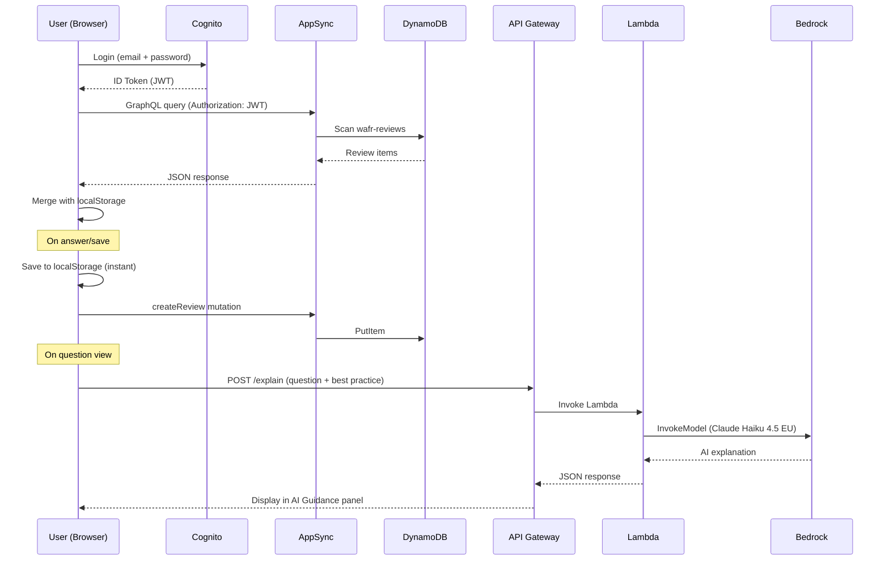
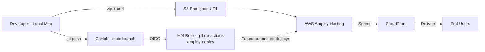

# Architecture Diagram

## Current State (Deployed)

```mermaid
flowchart TD
    User[TAM / Reviewer] -->|HTTPS| CF[CloudFront CDN]
    CF --> S3[S3 - Static Site via Amplify Hosting]
    S3 --> Browser[Browser - index.html]
    
    Browser -->|Auth via Cognito Identity JS SDK| Cognito[Amazon Cognito User Pool]
    Browser -->|GraphQL via fetch| AppSync[AWS AppSync API]
    Browser -->|POST /explain| APIGW[API Gateway HTTP API]
    AppSync --> DDBReviews[DynamoDB - wafr-reviews]
    AppSync --> DDBTemplates[DynamoDB - wafr-templates]
    APIGW --> Lambda[Lambda - wafr-explain]
    Lambda --> Bedrock[Bedrock - Claude Haiku 4.5]
    Browser -->|Fallback| LS[localStorage]

    subgraph AWS Account 590183747733 — eu-west-2
        CF
        S3
        Cognito
        AppSync
        DDBReviews
        DDBTemplates
        APIGW
        Lambda
        Bedrock
    end
```

## Data Flow



## Deployment Pipeline



## Services

| Service | Resource | Purpose | Status | Backup |
|---------|----------|---------|--------|--------|
| Amplify Hosting | App: `d1p2543h8l2mfc` | Static site hosting + CDN | ✅ Deployed | Git |
| CloudFront | Auto (via Amplify) | Content delivery | ✅ Active | N/A |
| S3 | Auto (via Amplify) | Static assets | ✅ Active | Git |
| Cognito | User Pool: `eu-west-2_Wy0eJHyN3` | User authentication | ✅ Configured | N/A (1-2 users) |
| AppSync | API: `4up36qgqubd6tcuekx5cmexmii` | GraphQL API | ✅ Configured | Git (schema) |
| DynamoDB | Table: `wafr-reviews` | Review storage | ✅ Active | ✅ PITR enabled |
| DynamoDB | Table: `wafr-templates` | Template storage | ✅ Active | ✅ PITR enabled |
| API Gateway | API: `6ylrfwa3d8` | HTTP API for AI explain | ✅ Active | Git (Lambda code) |
| Lambda | Function: `wafr-explain` | Calls Bedrock for AI guidance | ✅ Active | Git |
| Bedrock | `eu.anthropic.claude-haiku-4-5-20251001-v1:0` | AI explanation generation | ✅ Active | N/A |
| IAM | Role: `github-actions-amplify-deploy` | GitHub OIDC deploy | ✅ Configured | N/A |
| IAM | Role: `appsync-dynamodb-role` | AppSync → DynamoDB | ✅ Configured | N/A |
| IAM | Role: `lambda-bedrock-role` | Lambda → Bedrock | ✅ Configured | N/A |
| IAM | Role: `amplify-service-role` | Amplify service (unused) | ⚠️ Not working | N/A |

## Authentication Flow

```
User enters email + password
    │
    ▼
amazon-cognito-identity-js SDK (loaded from CDN)
    │
    ▼ SRP authentication
Cognito User Pool (eu-west-2_Wy0eJHyN3)
    │
    ▼ Returns JWT (ID Token)
Browser stores session in localStorage
    │
    ▼ Token used as Authorization header
AppSync GraphQL API (Cognito User Pool auth)
    │
    ▼
DynamoDB (reviews + templates)
```

## AI Guidance Flow

```
User opens a question
    │
    ▼
Browser sends POST to API Gateway
    https://6ylrfwa3d8.execute-api.eu-west-2.amazonaws.com/explain
    Body: { question, bestPractice }
    │
    ▼
API Gateway → Lambda (wafr-explain)
    │
    ▼
Lambda → Bedrock (eu.anthropic.claude-haiku-4-5-20251001-v1:0)
    Prompt: concise TAM review guidance
    Max tokens: 512
    │
    ▼
Response displayed in AI Guidance panel (right side)
    Panel can be minimised/expanded with − / + button
```

## Network Endpoints

| Endpoint | Purpose |
|----------|---------|
| `https://main.d1p2543h8l2mfc.amplifyapp.com` | App URL |
| `https://zernxhslmvhe3o7ucljc55dmjq.appsync-api.eu-west-2.amazonaws.com/graphql` | GraphQL API |
| `https://6ylrfwa3d8.execute-api.eu-west-2.amazonaws.com/explain` | AI Explain API |
| `https://cdn.jsdelivr.net/npm/amazon-cognito-identity-js@6/dist/amazon-cognito-identity.min.js` | Cognito SDK (CDN) |

## Cost Estimate (Monthly)

| Service | Expected Usage | Cost |
|---------|---------------|------|
| Amplify Hosting | <1GB served | Free tier |
| DynamoDB | <25 WCU/RCU, <1GB | Free tier |
| DynamoDB PITR | 2 small tables | ~$0.20 |
| AppSync | <250K queries | Free tier |
| Cognito | 1-2 users | Free tier |
| API Gateway | <100 requests/month | Free tier |
| Lambda | <100 invocations | Free tier |
| Bedrock (Haiku 4.5) | ~50 calls/month, 512 tokens each | ~$0.05 |
| **Total** | | **<$1/month** |
