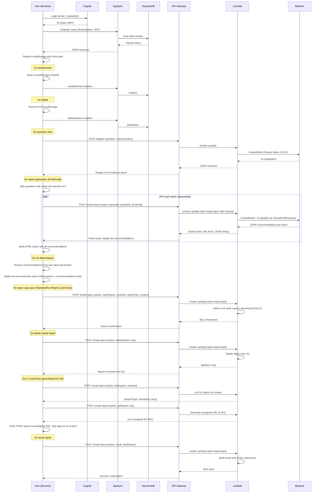
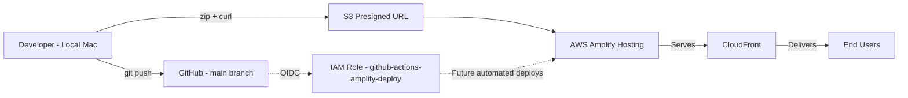

# Architecture Diagram

## Current State (Deployed)

```mermaid
flowchart TD
    User[TAM / Reviewer] -->|HTTPS| CF[CloudFront CDN]
    CF --> S3[S3 - Static Site via Amplify Hosting]
    S3 --> Browser[Browser - index.html]
    
    Browser -->|Auth via Cognito Identity JS SDK| Cognito[Amazon Cognito User Pool]
    Browser -->|GraphQL via fetch| AppSync[AWS AppSync API]
    Browser -->|POST /explain| APIGW[API Gateway HTTP API]
    Browser -->|POST /email-report| APIGW
    AppSync --> DDBReviews[DynamoDB - wafr-reviews]
    AppSync --> DDBTemplates[DynamoDB - wafr-templates]
    APIGW --> Lambda[Lambda - wafr-explain]
    APIGW --> LambdaEmail[Lambda - wafr-email-report]
    Lambda --> Bedrock[Bedrock - Claude Haiku 4.5]
    LambdaEmail --> Bedrock
    LambdaEmail --> SES[Amazon SES]
    LambdaEmail --> S3Reports[S3 - wafr-reports-danmmat-9219112]
    Browser -->|pptxgenjs CDN| PPTX[Client-side PPTX Generation]
    PPTX -->|saveReport| LambdaEmail
    Browser -->|Fallback| LS[localStorage]

    subgraph AWS Account 590183747733 — eu-west-2
        CF
        S3
        Cognito
        AppSync
        DDBReviews
        DDBTemplates
        APIGW
        Lambda
        LambdaEmail
        Bedrock
        SES
        S3Reports
    end
```

## Data Flow



## Deployment Pipeline



## Services

| Service | Resource | Purpose | Status | Backup |
|---------|----------|---------|--------|--------|
| Amplify Hosting | App: `d1p2543h8l2mfc` | Static site hosting + CDN | ✅ Deployed | Git |
| CloudFront | Auto (via Amplify) | Content delivery | ✅ Active | N/A |
| S3 | Auto (via Amplify) | Static assets | ✅ Active | Git |
| Cognito | User Pool: `eu-west-2_Wy0eJHyN3` | User authentication | ✅ Configured | N/A (1-2 users) |
| AppSync | API: `4up36qgqubd6tcuekx5cmexmii` | GraphQL API | ✅ Configured | Git (schema) |
| DynamoDB | Table: `wafr-reviews` | Review storage | ✅ Active | ✅ PITR enabled |
| DynamoDB | Table: `wafr-templates` | Template storage | ✅ Active | ✅ PITR enabled |
| API Gateway | API: `6ylrfwa3d8` | HTTP API for AI explain + email report | ✅ Active | Git (Lambda code) |
| Lambda | Function: `wafr-explain` | Calls Bedrock for AI guidance | ✅ Active | Git |
| Lambda | Function: `wafr-email-report` | Generates tailored reports, sends via SES, manages S3 reports (save/list/get/delete) (90s timeout, 256MB, parallel batching) | ✅ Active | Git |
| Bedrock | `eu.anthropic.claude-haiku-4-5-20251001-v1:0` | AI explanation + tailored recommendations | ✅ Active | N/A |
| S3 | Bucket: `wafr-reports-danmmat-9219112` | Auto-saved report storage | ✅ Active | N/A |
| SES | Verified sender: `danmmat@amazon.co.uk` | Email delivery for reports | ✅ Active (sandbox) | N/A |
| IAM | Role: `github-actions-amplify-deploy` | GitHub OIDC deploy | ✅ Configured | N/A |
| IAM | Role: `appsync-dynamodb-role` | AppSync → DynamoDB | ✅ Configured | N/A |
| IAM | Role: `lambda-bedrock-role` | Lambda (wafr-explain) → Bedrock | ✅ Configured | N/A |
| IAM | Role: `lambda-ses-email-role` | Lambda (wafr-email-report) → SES + Bedrock + S3 (PutObject, GetObject, ListBucket, DeleteObject) | ✅ Configured | N/A |
| IAM | Role: `amplify-service-role` | Amplify service (unused) | ⚠️ Not working | N/A |

## Authentication Flow

```
User enters email + password
    │
    ▼
amazon-cognito-identity-js SDK (loaded from CDN)
    │
    ▼ SRP authentication
Cognito User Pool (eu-west-2_Wy0eJHyN3)
    │
    ▼ Returns JWT (ID Token)
Browser stores session in localStorage
    │
    ▼ Token used as Authorization header
AppSync GraphQL API (Cognito User Pool auth)
    │
    ▼
DynamoDB (reviews + templates)
```

## AI Guidance Flow

```
User opens a question
    │
    ▼
Browser sends POST to API Gateway
    https://6ylrfwa3d8.execute-api.eu-west-2.amazonaws.com/explain
    Body: { question, bestPractice }
    │
    ▼
API Gateway → Lambda (wafr-explain)
    │
    ▼
Lambda → Bedrock (eu.anthropic.claude-haiku-4-5-20251001-v1:0)
    Prompt: concise TAM review guidance
    Max tokens: 512
    │
    ▼
Response displayed in AI Guidance panel (right side)
    Panel can be minimised/expanded with − / + button
    "What to ask the customer" is replaced with "Questions to think about" client-side
```

## Tailored Report Generation Flow

```
User clicks "Print Report" or "Email Report"
    │
    ▼
App collects all questions with notes/observations
    │
    ▼
Frontend splits questions into batches of 5
    │
    ▼
For each batch (sequential):
    Browser sends POST to API Gateway
        https://6ylrfwa3d8.execute-api.eu-west-2.amazonaws.com/email-report
        Body: { action: "generate", questions: [5 items] }
        │
        ▼
    API Gateway → Lambda (wafr-email-report, 90s timeout, 256MB)
        │
        ▼
    Lambda splits batch into sub-batches of 5
    ThreadPoolExecutor (4 workers) calls Bedrock in parallel
        Model: eu.anthropic.claude-haiku-4-5-20251001-v1:0
        Max tokens: 4096
        │
        ▼
    Returns: { statusCode: 200, body: "{\"recommendations\": {...}}" }
        │
        ▼
    Frontend parses body wrapper, merges into recommendations object
    │
    ▼
All batches complete → build HTML report:
    - Grey box: Bedrock-rewritten observation (polished prose)
    - Blue box: Tailored recommendation (bullets + clickable Further Reading URLs)
    │
    ├── Print Report: opens in new browser window
    ├── So What Report: focused executive view (observations + recommendations only, no RAG/Target State)
    └── Email Report: sends HTML attachment via SES
```

## So What Report Flow

```
User clicks "So What Report" (review summary or question view topbar)
    │
    ▼
App calls generateTailoredReport() — same batched Bedrock flow as Print Report
    │
    ▼
Recommendations cached in window._lastRecommendations
    │
    ▼
generateSoWhatHTML() builds focused executive report:
    - No RAG colours, Target State, or To Reach Green sections
    - Per question: "What we found" (observation) + "What to do" (recommendation)
    - AWS documentation URLs rendered as clickable links
    - Print/Close buttons (hidden in print via @media print)
    │
    ▼
Opens in new browser tab → user can Save as PDF via Cmd+P
```

## Saved Reports & C-Level Deck Grounding Flow

```
All reports (Standard, So What, C-Level Deck) auto-save to S3 after generation
    │
    ▼
Lambda action: saveReport
    Writes to s3://wafr-reports-danmmat-9219112/{reviewId}/{reportType}_{timestamp}.{ext}
    │
    ▼
User clicks "C-Level Deck" → modal shows dropdowns populated from S3
    │
    ▼
Lambda action: listReports → returns saved So What + Standard reports for that review
    │
    ▼
User selects reports → clicks Generate
    │
    ▼
Lambda action: getReport → returns presigned S3 URL (5 min expiry)
    │
    ▼
Browser fetches HTML via presigned URL, strips HTML tags
    │
    ▼
Text passed as grounding context to Bedrock (reduces hallucinations)
    │
    ▼
C-Level PowerPoint generated with grounded AI recommendations
    │
    ▼
PPTX saved to S3 only (no local download) → user accesses via Saved Reports modal
```

## Email Report Flow

```
User clicks "Email Report" → enters recipient email
    │
    ▼
App generates tailored report (as above)
    │
    ▼
Browser sends POST to API Gateway
    https://6ylrfwa3d8.execute-api.eu-west-2.amazonaws.com/email-report
    Body: { action: "email", recipient, htmlReport, customerName, reviewDate }
    │
    ▼
API Gateway → Lambda (wafr-email-report)
    │
    ▼
Lambda builds MIME email with HTML attachment
    │
    ▼
SES sends email from danmmat@amazon.co.uk
    │
    ▼
Note: SES is in sandbox mode — can only send to verified addresses
```

## Network Endpoints

| Endpoint | Purpose |
|----------|---------|
| `https://main.d1p2543h8l2mfc.amplifyapp.com` | App URL |
| `https://zernxhslmvhe3o7ucljc55dmjq.appsync-api.eu-west-2.amazonaws.com/graphql` | GraphQL API |
| `https://6ylrfwa3d8.execute-api.eu-west-2.amazonaws.com/explain` | AI Explain API |
| `https://6ylrfwa3d8.execute-api.eu-west-2.amazonaws.com/email-report` | Email Report + Tailored Recommendations API |
| `https://cdn.jsdelivr.net/npm/amazon-cognito-identity-js@6/dist/amazon-cognito-identity.min.js` | Cognito SDK (CDN) |
| `https://cdn.jsdelivr.net/npm/pptxgenjs@4.0.1/dist/pptxgen.bundle.js` | PowerPoint generation (CDN) |

## Cost Estimate (Monthly)

| Service | Expected Usage | Cost |
|---------|---------------|------|
| Amplify Hosting | <1GB served | Free tier |
| DynamoDB | <25 WCU/RCU, <1GB | Free tier |
| DynamoDB PITR | 2 small tables | ~$0.20 |
| AppSync | <250K queries | Free tier |
| Cognito | 1-2 users | Free tier |
| API Gateway | <100 requests/month | Free tier |
| Lambda | <100 invocations (explain) | Free tier |
| Lambda | <50 invocations (email-report) | Free tier |
| SES | <50 emails/month | Free tier |
| Bedrock (Haiku 4.5) | ~100 calls/month (explain + reports), 512-4096 tokens | ~$0.15 |
| S3 (Reports) | <1GB stored, <100 requests | ~$0.03 |
| **Total** | | **<$1/month** |
