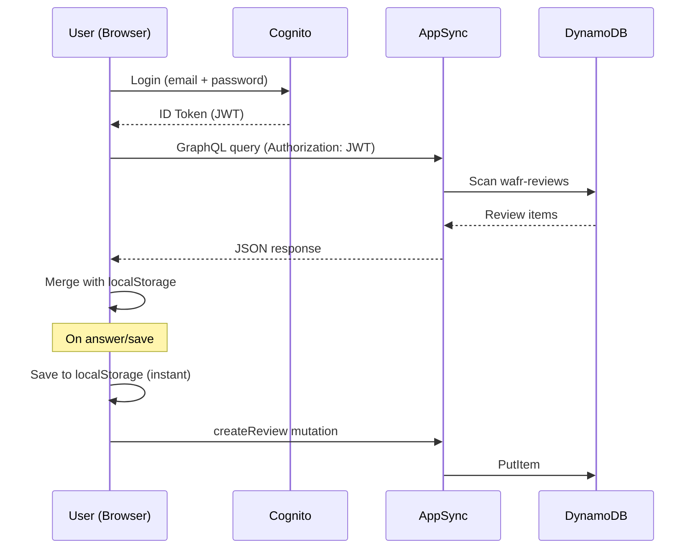
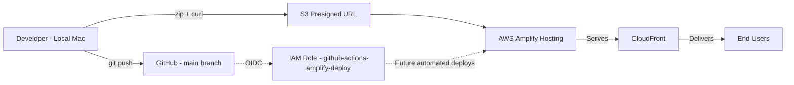

# Architecture Diagram

## Current State (Deployed)

```mermaid
flowchart TD
    User[TAM / Reviewer] -->|HTTPS| CF[CloudFront CDN]
    CF --> S3[S3 - Static Site via Amplify Hosting]
    S3 --> Browser[Browser - index.html]
    
    Browser -->|Auth via Cognito Identity JS SDK| Cognito[Amazon Cognito User Pool]
    Browser -->|GraphQL via fetch| AppSync[AWS AppSync API]
    AppSync --> DDBReviews[DynamoDB - wafr-reviews]
    AppSync --> DDBTemplates[DynamoDB - wafr-templates]
    Browser -->|Fallback| LS[localStorage]

    subgraph AWS Account 590183747733 — eu-west-2
        CF
        S3
        Cognito
        AppSync
        DDBReviews
        DDBTemplates
    end
```

## Data Flow



## Deployment Pipeline



## Services

| Service | Resource | Purpose | Status |
|---------|----------|---------|--------|
| Amplify Hosting | App: `d1p2543h8l2mfc` | Static site hosting + CDN | ✅ Deployed |
| CloudFront | Auto (via Amplify) | Content delivery | ✅ Active |
| S3 | Auto (via Amplify) | Static assets | ✅ Active |
| Cognito | User Pool: `eu-west-2_Wy0eJHyN3` | User authentication | ✅ Configured |
| AppSync | API: `4up36qgqubd6tcuekx5cmexmii` | GraphQL API | ✅ Configured |
| DynamoDB | Table: `wafr-reviews` | Review storage | ✅ Active |
| DynamoDB | Table: `wafr-templates` | Template storage | ✅ Active |
| IAM | Role: `github-actions-amplify-deploy` | GitHub OIDC deploy | ✅ Configured |
| IAM | Role: `appsync-dynamodb-role` | AppSync → DynamoDB | ✅ Configured |

## Authentication Flow

```
User enters email + password
    │
    ▼
amazon-cognito-identity-js SDK (loaded from CDN)
    │
    ▼ SRP authentication
Cognito User Pool (eu-west-2_Wy0eJHyN3)
    │
    ▼ Returns JWT (ID Token)
Browser stores session in localStorage
    │
    ▼ Token used as Authorization header
AppSync GraphQL API (Cognito User Pool auth)
    │
    ▼
DynamoDB (reviews + templates)
```

## Network Endpoints

| Endpoint | Purpose |
|----------|---------|
| `https://main.d1p2543h8l2mfc.amplifyapp.com` | App URL |
| `https://zernxhslmvhe3o7ucljc55dmjq.appsync-api.eu-west-2.amazonaws.com/graphql` | GraphQL API |
| `https://cdn.jsdelivr.net/npm/amazon-cognito-identity-js@6/dist/amazon-cognito-identity.min.js` | Cognito SDK (CDN) |
