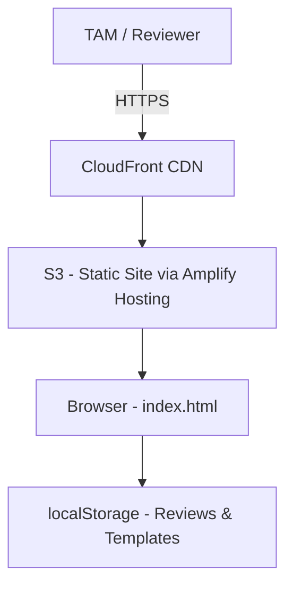
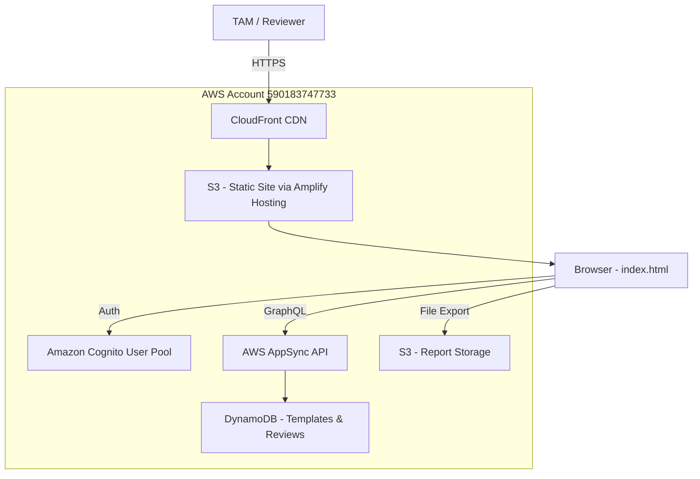
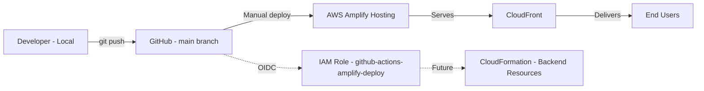

# Architecture Diagram

## Current State (Offline Mode)



## Target State (Cloud Mode)



## Deployment Pipeline



## Network Flow

```
User (Browser)
    │
    ▼ HTTPS (TLS 1.2+)
CloudFront (d1p2543h8l2mfc.amplifyapp.com)
    │
    ▼
S3 Origin (Amplify Managed)
    │
    ▼ (JavaScript in browser)
┌─────────────────────────────────────┐
│  Offline Mode: localStorage only    │
│  Cloud Mode:                        │
│    → Cognito (auth)                 │
│    → AppSync (data)                 │
│    → S3 (exports)                   │
└─────────────────────────────────────┘
```

## Services Used

| Service | Purpose | Status |
|---------|---------|--------|
| Amplify Hosting | Static site hosting + CDN | ✅ Deployed |
| CloudFront | Content delivery | ✅ Auto (via Amplify) |
| S3 | Static assets | ✅ Auto (via Amplify) |
| Cognito | User authentication | ⏳ Not yet configured |
| AppSync | GraphQL API | ⏳ Not yet configured |
| DynamoDB | Data storage (reviews, templates) | ⏳ Not yet configured |
| S3 (exports) | Report file storage | ⏳ Not yet configured |
| IAM (OIDC) | GitHub Actions → AWS auth | ✅ Configured |
